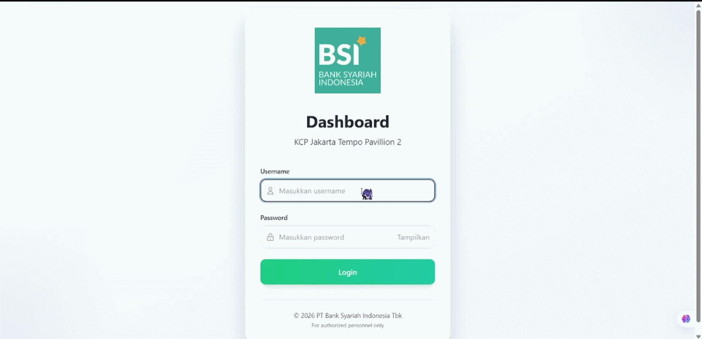
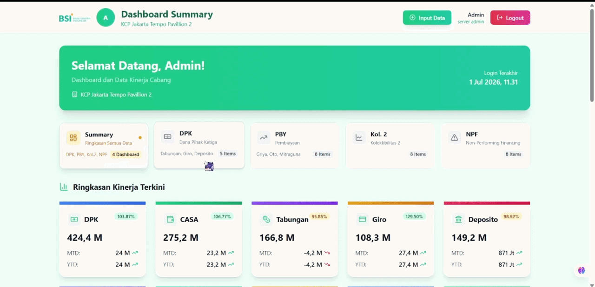
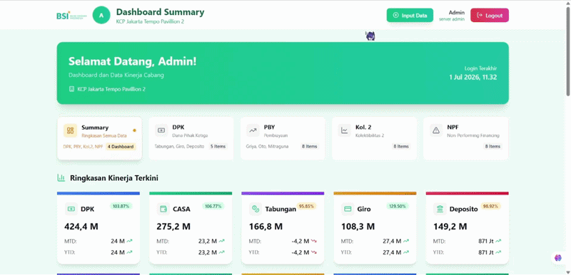
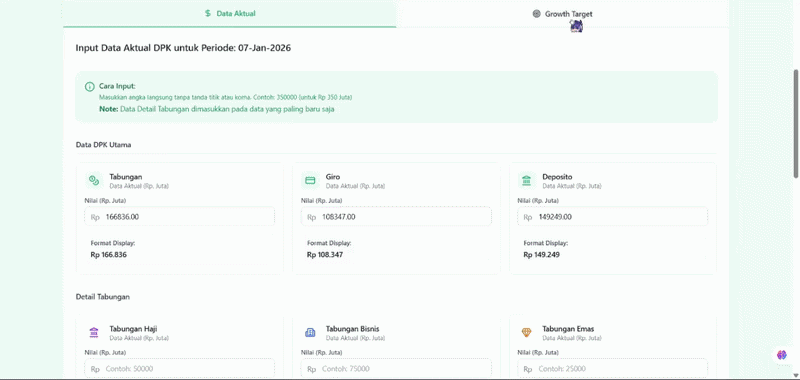
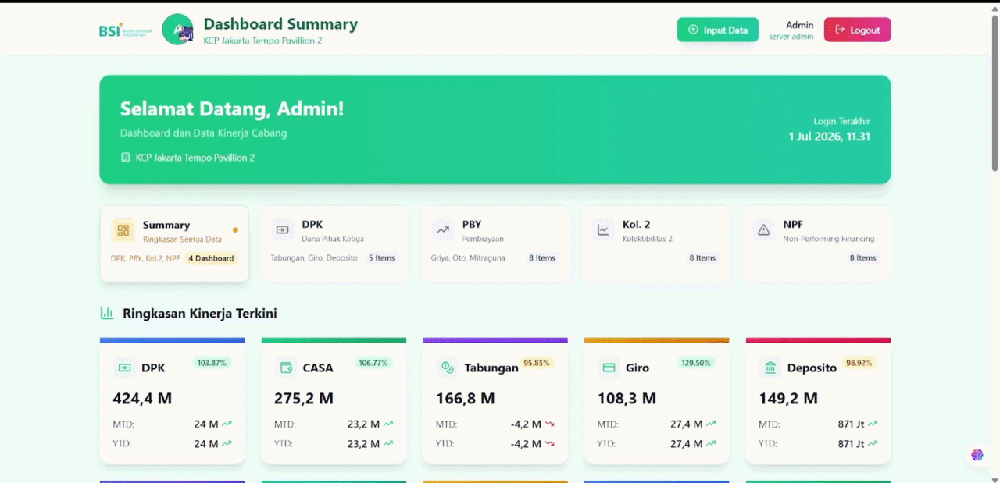

# Dashboard Monitoring Branch (DashMoB)

DashMoB was built to digitize and simplify branch performance monitoring that was previously managed through spreadsheets and presentation reports. The system centralizes key financial and operational metrics into a responsive dashboard, enabling faster reporting, easier data management, activity tracking, and secure access from both desktop and mobile devices.

> ⚠️ DISCLAIMER
>
> This project was developed during an internship at Bank Syariah Indonesia (BSI) for educational and portfolio purposes.
>
> - The BSI logo and trademark belong to Bank Syariah Indonesia.
> - All data displayed in this repository are dummy/simulated data.
> - No confidential or production banking data is included.
> - This repository is not affiliated with or officially endorsed by Bank Syariah Indonesia.

---

# Project Overview

This dashboard was created to simplify branch performance monitoring and reporting. It provides a centralized interface for managing and tracking important branch metrics.

## Main Features

- Secure JWT Authentication
- Dashboard Overview
- DPK Monitoring
- Tabungan Monitoring
- PBY Monitoring
- KOL2 Monitoring
- NPF Monitoring
- CRUD Data Management
- Activity Logging
- Profile Management
- Responsive Design

# Demo Preview

## 1. Login Authentication

User authentication using JWT-based login system.



---

## 2. Dashboard Overview

Overview of branch performance metrics and summary information.


---

## 3. Navigation Between Monitoring Sections

Switching between DPK, PBY, KOL2, NPF, and other monitoring modules.



---

## 4. DPK Monitoring Dashboard

Monitoring DPK performance, CASA, Giro, Deposito, and Tabungan metrics.


---

## 5. DPK Data Input & Management

Creating and updating DPK data through the management interface.

<p align="center">
  
  
</p>

---

## 6. Profile Management

User profile management and password update functionality.



---

# Tech Stack

## Frontend

- React.js
- React Router DOM
- Axios
- Framer Motion
- Lucide React

## Backend

- Node.js
- Express.js
- MySQL
- JWT Authentication
- bcryptjs
- CORS

---

# Folder Structure

```text
dashboard/
│
├── client/
│   ├── public/
│   ├── src/
│   │   ├── components/
│   │   ├── pages/
│   │   └── services/
│   └── package.json
│
├── server/
│   ├── server.js
│   ├── package.json
│   └── .env.example
│
└── README.md
```

---

# Installation

## Clone Repository

```bash
git clone https://github.com/yourusername/dashboard-branch.git

cd dashboard-branch
```

---

## Backend

```bash
cd server

npm install
```

Create `.env`

```env
PORT=
DB_HOST=your_host
DB_PORT=
DB_USER=your_username
DB_PASSWORD=your_password
DB_NAME=your_database
JWT_SECRET=your_secret
```

Run backend

```bash
npm start
```

Backend runs on

```
http://localhost:5000
```

---

## Frontend

```bash
cd client

npm install
```

Create `.env.local`

```env
REACT_APP_API_URL=http://localhost:5000
```

Run

```bash
npm start
```

Frontend runs on

```
http://localhost:3000
```

---

# Deployment

## Frontend

Vercel

https://dashboard-tau-seven-19.vercel.app/

## Backend

Vercel

https://dashboard-backend-virid.vercel.app/

---

# API Overview

## Authentication

- POST /api/login
- GET /api/verify-token
- POST /api/logout

## Dashboard

- GET /api/dashboard
- GET /api/branch-data

## DPK

- GET /api/dpk
- POST /api/dpk
- DELETE /api/dpk/:period

## Tabungan

- GET /api/tabungan
- POST /api/tabungan
- DELETE /api/tabungan/:period

## PBY

- GET /api/pby
- POST /api/pby
- DELETE /api/pby/:period

## KOL2

- GET /api/kol2
- POST /api/kol2
- DELETE /api/kol2/:period

## NPF

- GET /api/npf
- POST /api/npf
- DELETE /api/npf/:period

## Activity Logs

- GET /api/activity-logs
- GET /api/activity-logs/my
- GET /api/activity-logs/stats

## User Profile

- GET /api/profile
- PATCH /api/users/profile
- PATCH /api/users/password

---

# Database

The application uses MySQL with several main tables:

- users
- activity_logs
- dpk_data
- tabungan_data
- pby_data
- kol2_data
- npf_data

The complete database schema has been comitted from this public repository for simplicity.

---

# Project Status

Implemented features:

- JWT Authentication
- CRUD Operations
- Dashboard Monitoring
- Activity Logging
- Profile Management
- Responsive UI
- REST API
- MySQL Integration
- Deployment on Vercel
- Role-Based Access Control
- Multi Branch Support

---

# Future Improvements

- Automatic Report
- Data Visualization (Charts)
- Export PDF & Excel
- Refactor and put the backend in order
- Notifications

---

# What I Learned

This internship gave me hands-on experience in:

- Full Stack Development
- REST API Development
- React.js Development
- Express.js
- MySQL Database Design
- Authentication using JWT
- Password Hashing
- Backend Deployment
- Frontend Deployment
- Git Version Control
- Software Documentation

---

# Acknowledgments

Special thanks to:

- Bank Syariah Indonesia (BSI)
- My internship supervisor and mentor
- The branch team for valuable feedback and guidance

---

# License

This repository is shared for educational, learning, and portfolio purposes.

You are welcome to use this source code as a reference, learning resource, or starting template for your own projects. Modification and further development of the code are encouraged.

The Bank Syariah Indonesia (BSI) name, logo, trademarks, and any related brand assets remain the property of Bank Syariah Indonesia and are not included in this permission.

All data displayed in this project are simulated and provided for demonstration purposes only.

---

# Author

**Abthal Akbar**

Full Stack Developer Intern / Junior Sales Marketing

Email: abthalakbar@gmail.com

LinkedIn:
https://linkedin.com/in/abthal-akbar-595a4828a

GitHub:
https://github.com/butterscotchh

---

If you find this project useful, feel free to leave a ⭐ on the repository.